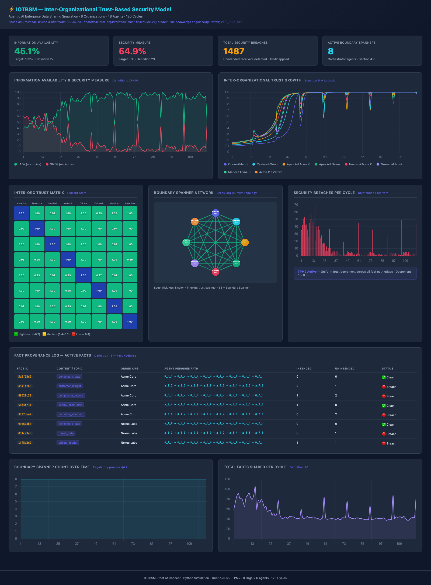

# IOTBSM POC

Proof-of-concept simulation for **inter-organizational trust-based sharing** of sensitive information in an **agentic AI / enterprise** setting, based on:

- Hexmoor, H., Wilson, S., & Bhattaram, S. (2006). [*A theoretical inter-organizational trust-based security model*](https://doi.org/10.1017/S0269888906000932). *The Knowledge Engineering Review*, 21(2), 127–161.

This project implements the model in a **single Python codebase** (standard library only), maps organizations and agents to an enterprise-AI metaphor, and emits a **self-contained interactive HTML dashboard** (embedded Chart.js and SVG) after each run.

## Sample dashboard

After a run, open the generated HTML in a browser. The dashboard includes **IA/SM** time series, **inter-organizational trust** (heatmap and selected pair trends), **breaches** and sharing activity, a **network** view, **provenance-style** pedigree samples, and summary statistics.



## What this POC simulates

- **Agents** create and consume facts inside each organization.
- **Boundary spanners (BS)** act as cross-organization representatives.
- **Trust dynamics** evolve across intra-org, inter-org, and inter-BS relations.
- **Breach handling** applies one of three Trust Policy Models (TPM1 / TPM2 / TPM3).
- **Metrics** include Information Availability (IA), Security Measure (SM), breaches, fact sharing, and trust history.

## Repository layout

- `run.py` — CLI entrypoint; runs the simulation and writes the dashboard.
- `simulation.py` — Organizations, agents, boundary spanners, facts, trust calculus, TPM handling, metrics history, and graph helpers.
- `dashboard.py` — Builds the standalone HTML report from a finished `IOTBSMSimulation`.
- `dashboard.html` — Typical output path when you run with defaults (overwritten each run unless you pass `--output`).

## Requirements

- Python **3.9+** (uses `dict[str, …]` style annotations)
- **Standard library only** — no `pip install` or `requirements.txt`

## Quick start

Run with defaults:

```bash
python3 run.py
```

Run with explicit parameters:

```bash
python3 run.py \
  --orgs 8 \
  --agents 6 \
  --cycles 120 \
  --tpm 2 \
  --threshold 0.35 \
  --decrement 0.08 \
  --alpha 0.65 \
  --output ./dashboard.html
```

## CLI parameters

- `--orgs` (int, default `8`): number of organizations.
- `--agents` (int, default `6`): agents per organization.
- `--cycles` (int, default `120`): number of simulation cycles.
- `--tpm` (`1` | `2` | `3`, default `2`): trust policy model after a breach.
  - `1`: **TPM1** — proportional (exponential-style) reduction along the fact path.
  - `2`: **TPM2** — uniform decrement across entities on the path.
  - `3`: **TPM3** — initiator reduces trust in all entities on the path.
- `--threshold` (float, default `0.35`): trust threshold for decisions.
- `--decrement` (float, default `0.08`): trust decrement factor used when TPM applies.
- `--alpha` (float, default `0.65`): weight on inter-organizational trust in combined trust.
- `--output` (path, default `./dashboard.html`): HTML dashboard path.

## Outputs

Each run prints:

- Parameter summary and progress every 20 cycles.
- Final summary: IA%, SM%, breach count, active boundary spanners, and a text **inter-org trust matrix**.

Each run generates:

- A **single HTML file** at `--output` with interactive charts and static SVG (no external assets required).

## Compare TPM modes

Run three times with the same horizon and differing `--tpm`, writing to separate files:

```bash
mkdir -p out
python3 run.py --cycles 120 --tpm 1 --output ./out/baseline_tpm1.html
python3 run.py --cycles 120 --tpm 2 --output ./out/baseline_tpm2.html
python3 run.py --cycles 120 --tpm 3 --output ./out/baseline_tpm3.html
```

Open the three HTML files in a browser to compare TPM behavior. **Note:** this codebase does not yet expose a `--seed`; successive runs are stochastic.

## Notes

- For a **PNG dashboard**, `matplotlib`/`numpy` workflow, and additional modules (`agents.py`, `trust_policy.py`, mock LLM assessor, etc.), see the sibling project [IOTBSM_POC](https://github.com/sethlwilson/IOTBSM_POC).
